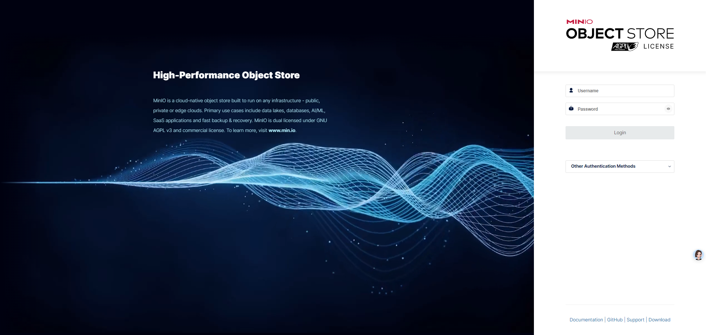
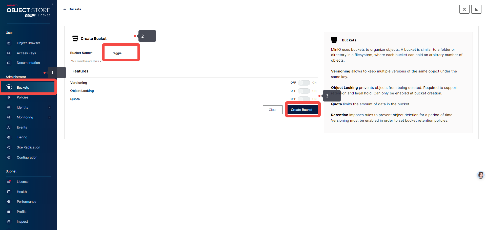
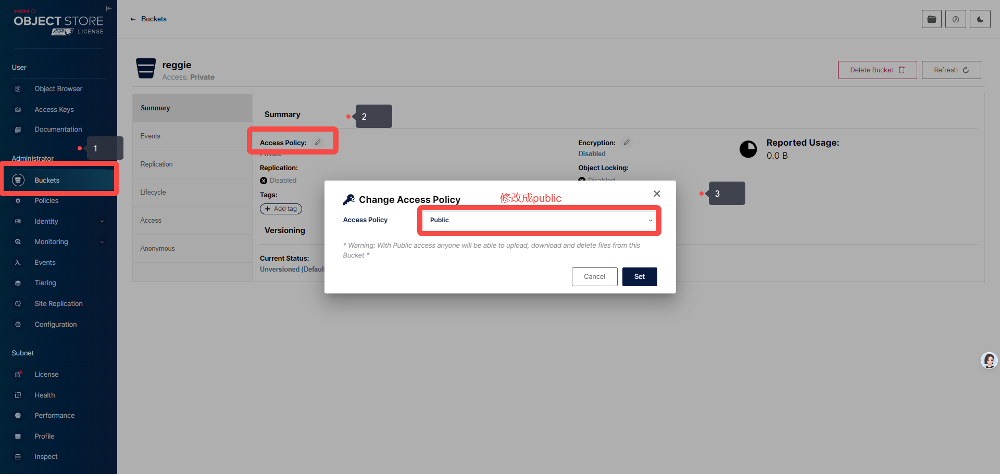
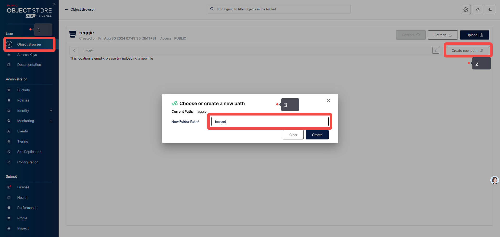
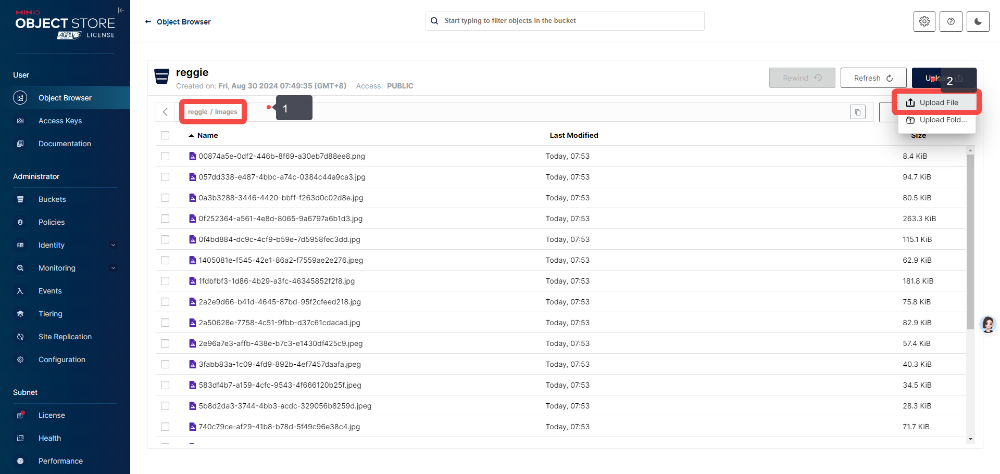

基于黑马程序员的瑞吉外卖项目 魔改的 go语言版瑞吉外卖项目
使用到的技术栈
gin + gorm + jwt + redis + mysql

~~~
# 安装 GORM
go get -u gorm.io/gorm
# 使用 mysql 作为数据库
go get -u gorm.io/driver/mysql  

# 安装 gin
go get -u github.com/gin-gonic/gin

# 安装 Viper
go get -u github.com/spf13/viper

# 安装 gin session 管理库
go get github.com/gin-contrib/sessions
go get github.com/gin-contrib/sessions/cookie

# 安装 sonyflake 主要为了数据库主键的雪花id
go get github.com/sony/sonyflake

# 安装 uuid 库
go get github.com/google/uuid

# 安装 minio SDK
go get github.com/minio/minio-go/v7

# 安装 copier
go get github.com/jinzhu/copier
~~~

## minio的安装及配置
因为菜品图片需要上传到服务器中，通常有两种方式，一种是上传到本地，一种是上传到云端，这里我们选择上传到云端，使用minio作为对象存储服务。
(为了给自己加点难度,因为crud写烦了)，如果你不想这样做，也可以选择上传到本地，但是需要修改一些代码。这部分我会丢到补充部分。

### minio的安装
这里选择使用docker容器的方式
~~~
# 第一步：拉取镜像
docker pull minio/minio

# 第二步：启动
docker run  -p 9000:9000  -p 9001:9001  --name minio  -d --restart=always -e "MINIO_ROOT_USER=reggie" -e "MINIO_ROOT_PASSWORD=reggie123456" minio/minio server /data --console-address ":9001"
~~~

> 注意：这里的MINIO_ROOT_USER和MINIO_ROOT_PASSWORD是minio的账号和密码，可以自行修改，但是需要和配置文件中的配置一致。

安装完成后访问 http://localhost:9001 即可

> 不同版本可能界面不一样，但是功能是一样的。

### minio的配置
1. 创建一个bucket，名字为reggie，这个bucket的名字需要和配置文件中的配置一致。

2. 设置bucket的权限为public，这样我们就可以通过url访问到图片了。

3. 创建一个文件夹，名字为 images ,并将图片资源上传

4. 测试是否可以访问
如果你完全按照我的步骤的话，浏览器访问
http://localhost:9000/reggie/images/00874a5e-0df2-446b-8f69-a30eb7d88ee8.png
即可看到图片
